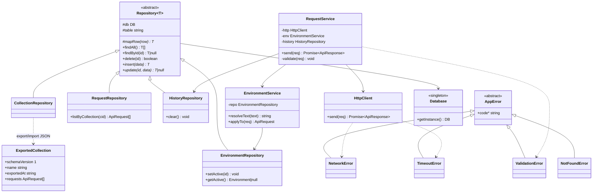

# Class Diagram — REST API Client

```mermaid
classDiagram
    class Repository~T~ {
        <<abstract>>
        #db DB
        #table string
        #mapRow(row)* T
        +findAll() T[]
        +findById(id) T|null
        +delete(id) boolean
        +insert(data)* T
        +update(id, data)* T|null
    }
    class CollectionRepository
    class RequestRepository {
        +listByCollection(cid) ApiRequest[]
    }
    class EnvironmentRepository {
        +setActive(id) void
        +getActive() Environment|null
    }
    class HistoryRepository {
        +clear() void
    }
    Repository <|-- CollectionRepository
    Repository <|-- RequestRepository
    Repository <|-- EnvironmentRepository
    Repository <|-- HistoryRepository

    class AppError {
        <<abstract>>
        +code* string
    }
    class ValidationError
    class NetworkError
    class TimeoutError
    class NotFoundError
    AppError <|-- ValidationError
    AppError <|-- NetworkError
    AppError <|-- TimeoutError
    AppError <|-- NotFoundError

    class HttpClient {
        +send(req) Promise~ApiResponse~
    }
    class EnvironmentService {
        -repo EnvironmentRepository
        +resolveText(text) string
        +applyTo(req) ApiRequest
    }
    class RequestService {
        -http HttpClient
        -env EnvironmentService
        -history HistoryRepository
        +send(req) Promise~ApiResponse~
        -validate(req) void
    }
    class ExportedCollection {
        +schemaVersion 1
        +name string
        +exportedAt string
        +requests ApiRequest[]
    }
    class Database {
        <<singleton>>
        +getInstance() DB
    }

    CollectionRepository ..> ExportedCollection : export/import JSON
    RequestService --> HttpClient
    RequestService --> EnvironmentService
    RequestService --> HistoryRepository
    EnvironmentService --> EnvironmentRepository
    HttpClient ..> NetworkError
    HttpClient ..> TimeoutError
    RequestService ..> ValidationError
    Repository --> Database
```
